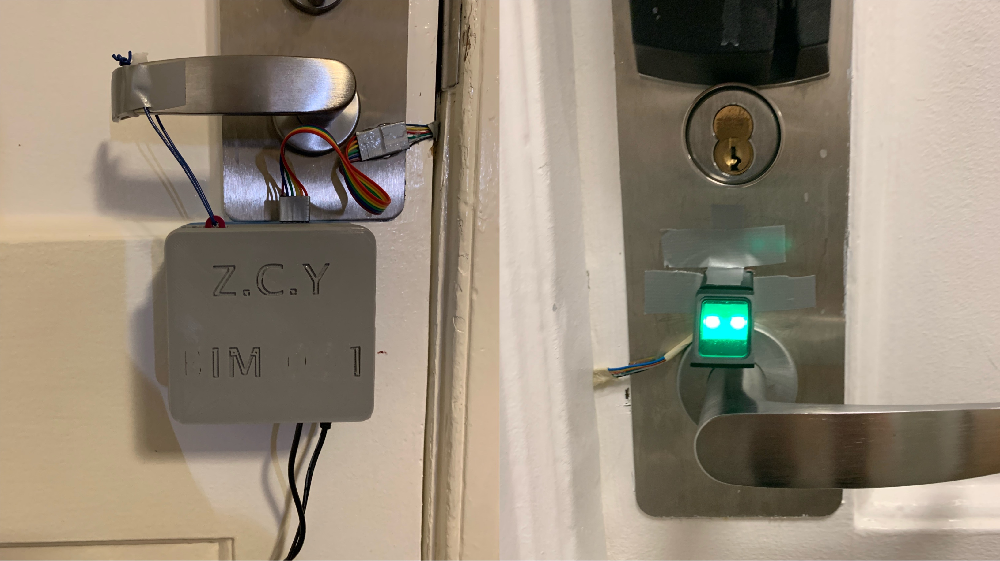

# 001Print

This repo is for project BIM001-Print, which is a fingerprint lock designed for Duke's East House dorm.

`main` folder has the Arduino code file which the fingerprint lock runs.
`case` folder has the Fusion 360 project files of the 3D-printed cases.
Other folders contain test code of individual components. 

See detailed project description [here](https://zhouchengyang.com/2021/11/26/BIM001-print/)
